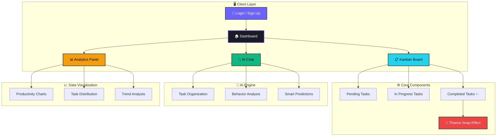
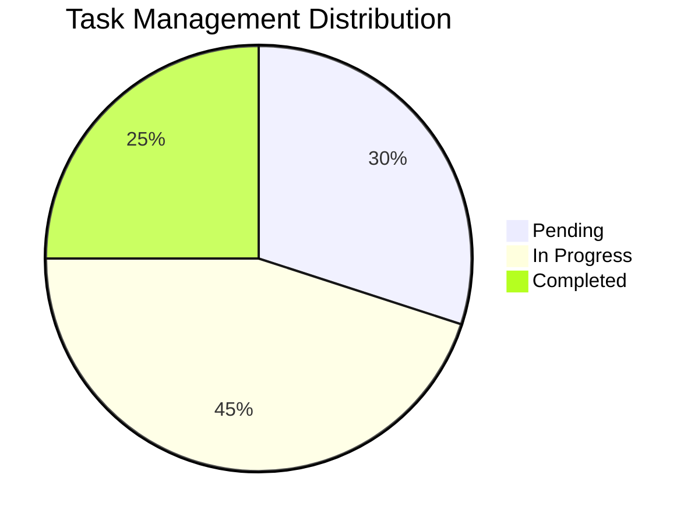
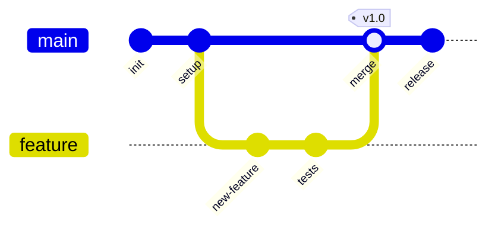

<div align="center">

<!-- Animated Header -->


<!-- Typing Animation -->
<a href="https://git.io/typing-svg"></a>

<br/>

<!-- Badges Row -->
[](https://react.dev/)
[](https://www.typescriptlang.org/)
[](https://vitejs.dev/)
[](https://tailwindcss.com/)

[](https://github.com/SUMAN-IG/Replit-vibathon/stargazers)
[](https://github.com/SUMAN-IG/Replit-vibathon/network)
[](https://github.com/SUMAN-IG/Replit-vibathon/issues)
[](LICENSE)

</div>

<br/>

<!-- Colorful Divider -->


## 🎬 Overview

> **TaskMate AI** is a next-generation productivity dashboard that combines the power of **Artificial Intelligence** with a stunning **dark-mode UI**. It helps you manage tasks smarter — not harder — with drag-and-drop Kanban boards, intelligent analytics, and a unique Thanos Snap effect for task completion! 🫰✨

<br/>

<!-- Feature Cards as Table -->
<div align="center">
<table>
<tr>
<td align="center" width="25%">

<br/><b>AI-First Onboarding</b>
<br/><sub>Tell the AI your tasks and it organizes everything automatically</sub>
</td>
<td align="center" width="25%">

<br/><b>Smart Kanban Board</b>
<br/><sub>Drag-and-drop tasks between Pending, In Progress & Completed</sub>
</td>
<td align="center" width="25%">

<br/><b>Analytics & Charts</b>
<br/><sub>Track productivity with beautiful Recharts visualizations</sub>
</td>
<td align="center" width="25%">

<br/><b>AI Predictions</b>
<br/><sub>Get intelligent suggestions and behavior analysis</sub>
</td>
</tr>
<tr>
<td align="center" width="25%">

<br/><b>Dark Mode UI</b>
<br/><sub>Clean, modern developer-friendly aesthetic</sub>
</td>
<td align="center" width="25%">

<br/><b>Authentication</b>
<br/><sub>Secure login and signup system</sub>
</td>
<td align="center" width="25%">

<br/><b>Smooth Animations</b>
<br/><sub>Powered by Framer Motion transitions</sub>
</td>
<td align="center" width="25%">

<br/><b>Thanos Snap Effect</b>
<br/><sub>Particle disintegration on task completion</sub>
</td>
</tr>
</table>
</div>

<br/>


## 🛠️ Tech Stack & Tools

<div align="center">

| Category | Technologies |
|:--------:|:-------------|
| **⚛️ Frontend** |    |
| **🎨 Styling** |   |
| **🧩 UI Components** |   |
| **📊 Data Viz** |  |
| **✨ Animations** |  |
| **🔧 Build Tools** |   |
| **🗂️ State & Forms** |   |

</div>

<br/>


## 📊 Architecture & Flow





<br/>


## 📂 Project Structure

```
📦 TaskMate AI
├── 🎯 App.tsx                          # Main application component
├── 🔔 RemindersPopover.tsx             # Reminder notifications
├── 🚀 main.tsx                         # Application entry point
├── 🌐 index.html                       # HTML template
├── ⚡ vite.config.ts                   # Vite configuration
├── 📦 package.json                     # Dependencies & scripts
├── 🎨 globals.css                      # Global design tokens
├── 💅 index.css                        # Core styles & Tailwind
│
├── 📁 components/
│   ├── 🔐 LoginPage.tsx               # Auth - Login
│   ├── 📝 SignUpPage.tsx               # Auth - Sign Up
│   ├── 🧭 TopBar.tsx                  # Navigation bar
│   ├── 📊 StatsOverview.tsx           # Statistics cards
│   ├── ✅ CompletedTaskCard.tsx        # Completed tasks
│   ├── 🔄 InProgressTaskCard.tsx      # In-progress tasks
│   ├── ⏳ PendingTaskCard.tsx          # Pending tasks
│   ├── 🤖 EnhancedAIChatButton.tsx    # AI chat interface
│   ├── 📈 SoloModeGraphs.tsx          # Analytics charts
│   ├── 🧠 BehaviorStudyAdvices.tsx    # AI behavior analysis
│   ├── 💫 ThanosSnapOverlay.tsx       # Snap animation
│   ├── 👋 WelcomeBanner.tsx           # Welcome banner
│   └── 🧩 ui/                         # Shadcn UI components
│
└── 📁 styles/
    └── 🎨 globals.css                 # Design system tokens
```

<br/>


## ⚡ Quick Start

<div align="center">

```
  ┌─────────────────────────────────────────────────────────────────┐
  │                                                                 │
  │   $ git clone https://github.com/SUMAN-IG/Replit-vibathon.git  │
  │   $ cd Replit-vibathon                                          │
  │   $ npm install                                                 │
  │   $ npm run dev                                                 │
  │                                                                 │
  │   🚀 Server running at http://localhost:5173                    │
  │                                                                 │
  └─────────────────────────────────────────────────────────────────┘
```

</div>

### Prerequisites

| Requirement | Version | Check |
|:-----------:|:-------:|:-----:|
|  | v16+ | `node --version` |
|  | v8+ | `npm --version` |

### Step-by-Step Installation

```bash
# 1️⃣ Clone the repository
git clone https://github.com/SUMAN-IG/Replit-vibathon.git

# 2️⃣ Navigate to the project directory
cd Replit-vibathon

# 3️⃣ Install dependencies
npm install

# 4️⃣ Start the development server
npm run dev

# 5️⃣ Build for production
npm run build
```

<br/>


## 🎮 Usage Guide

<details>
<summary><b>🆕 First Time Setup</b> (click to expand)</summary>
<br/>

1. 📝 Click **"Sign up"** on the login page
2. 🔑 Create your account with name, email, username, and password
3. 🔐 Sign in with your credentials
4. 🤖 Use the AI chat to describe your tasks — it organizes them automatically!
5. 🖱️ Drag and drop tasks between columns to update status

</details>

<details>
<summary><b>✨ Key Features</b> (click to expand)</summary>
<br/>

| Action | How To |
|:-------|:-------|
| ➕ **Add Task** | Click the "+ Add Task" button in the top bar |
| 🤖 **AI Chat** | Click the AI button in the bottom right corner |
| 👤 **Profile** | Click your avatar in the top right |
| 🔄 **Drag & Drop** | Drag tasks between Pending → In Progress → Completed |
| 🔍 **Task Details** | Click any task card to view full details |
| 💫 **Thanos Snap** | Watch the particle effect when completing tasks! |

</details>

<details>
<summary><b>💾 Data Storage</b> (click to expand)</summary>
<br/>

Currently uses **localStorage** for user data. For production, upgrade to:

| Service | Type | Link |
|:--------|:-----|:-----|
|  | Backend Auth | [supabase.com](https://supabase.com) |
|  | Auth + DB | [firebase.google.com](https://firebase.google.com) |
|  | Identity | [auth0.com](https://auth0.com) |

</details>

<br/>


## 📈 GitHub Stats & Activity

<div align="center">

<!-- Repository Stats -->


<br/><br/>

<!-- Owner's GitHub Stats -->


<br/><br/>

<!-- GitHub Streak -->


<br/><br/>

<!-- Activity Graph -->


</div>

<br/>


## 🌐 Browser Support

<div align="center">

|  |  |  |  |
|:---:|:---:|:---:|:---:|
| ✅ Recommended | ✅ Supported | ✅ Supported | ✅ Supported |

</div>

<br/>


## 🤝 Contributing

Contributions are welcome! Feel free to open issues or submit pull requests.



<br/>

## 📜 License

<div align="center">

Distributed under the **MIT License**. See `LICENSE` for more information.

[](https://opensource.org/licenses/MIT)

</div>

<br/>

## 🙏 Acknowledgments

<div align="center">

| Inspiration | Resources |
|:-----------:|:---------:|
| [Linear](https://linear.app) | [Lucide Icons](https://lucide.dev) |
| [Notion](https://notion.so) | [Shadcn/ui](https://ui.shadcn.com) |
| [Replit](https://replit.com) | [Unsplash](https://unsplash.com) |

</div>

<br/>


<div align="center">

### 👨‍💻 Built with ❤️ by [SUMAN-IG](https://github.com/SUMAN-IG)

<br/>

[](https://github.com/SUMAN-IG)
[](https://github.com/SUMAN-IG/Replit-vibathon)

<br/>

<!-- Visitor Counter -->


<br/><br/>

<!-- Footer Wave -->


</div>
